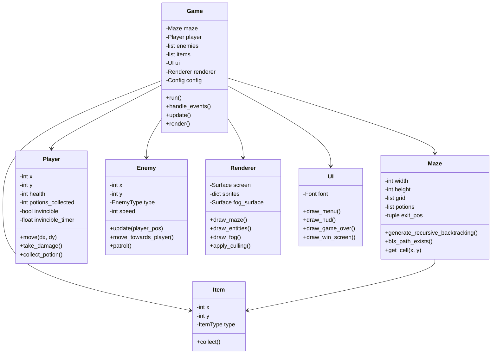
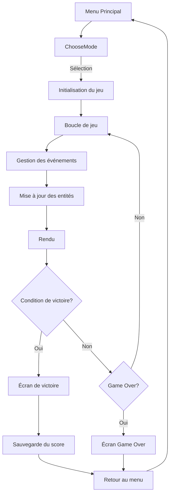

# Architecture du Jeu de Labyrinthe Pygame

## Spécifications techniques
- **Résolution** : 800x600 pixels
- **FPS** : 30
- **Tile size** : 48x48 pixels (redimensionné depuis 16x16 avec NEAREST neighbor)
- **Modes de difficulté** :
  - Facile : 10x10, 3 potions, pas de brouillard, 1 ennemi
  - Moyen : 20x20, 6 potions, brouillard rayon 5, 3 ennemis
  - Difficile : 30x30, 10 potions, brouillard rayon 3, 5 ennemis
  - Extrême : 40x40, 15 potions, brouillard rayon 2, 8 ennemis avec IA chasseuse
- **High score** : Sauvegardé pour tous les modes dans `highscore.json`

## Structure des fichiers
```
mon_projet_labyrinthe/
├── assets/                    # Sprites 16x16
│   ├── tile_0001.png          # Mur
│   ├── tile_0043.png          # Sol (variante 1)
│   ├── tile_0048.png          # Sol (variante 2)
│   ├── tile_0049.png          # Sol (variante 3)
│   ├── tile_0096.png          # Joueur
│   ├── tile_0084.png          # Ennemi Sorcier
│   ├── tile_0108.png          # Ennemi Fantôme
│   ├── tile_0109.png          # Ennemi Monstre
│   ├── tile_0113.png          # Potion 1
│   ├── tile_0114.png          # Potion 2
│   ├── tile_0115.png          # Potion 3
│   ├── tile_0116.png          # Potion 4
│   ├── tile_0045.png          # Porte de sortie
│   ├── tile_0089.png          # Coffre (piège/obstacle)
│   └── tile_0044.png          # Vie (HUD)
├── main.py                    # Point d'entrée principal
├── game.py                    # Classe Game principale
├── maze.py                    # Génération de labyrinthe et BFS
├── entities.py                # Joueur, Ennemis, Items
├── renderer.py                # Système de rendu avec culling et brouillard
├── ui.py                      # Menu, HUD, écrans de fin
├── config.py                  # Configuration et constantes
├── utils.py                   # Fonctions utilitaires
├── highscore.json             # Sauvegarde des scores
└── requirements.txt           # Dépendances Python
```

## Diagramme de classes


## Flux du jeu


## Mécaniques principales
1. **Génération de labyrinthe** : Recursive Backtracking garantissant un chemin unique
2. **Vérification BFS** : Vérifie que toutes les potions et la sortie sont accessibles
3. **Brouillard de guerre** : Surface alpha avec trou centré sur le joueur
4. **Culling** : Ne dessine que les tiles visibles à l'écran
5. **IA ennemis** :
   - Modes Facile/Moyen/Difficile : Déplacement aléatoire
   - Mode Extrême : Poursuite du joueur si dans un rayon de 8 cases
6. **Système de santé** : 3 cœurs, invincibilité temporaire après dégât
7. **High score** : Temps le plus rapide pour chaque mode

## Configuration des assets
- Tous les sprites sont redimensionnés de 16x16 à 48x48 avec `pygame.transform.scale(..., (48, 48), pygame.NEAREST)`
- Fallback : Si un asset est manquant, utiliser des formes géométriques colorées
- Mapping des tiles :
  - Joueur : tile_0096.png (bleu)
  - Ennemis : Sorcier (0084), Fantôme (0108), Monstre (0109)
  - Potions : 0113-0116 (rouge, vert, bleu, violet)
  - Sortie : tile_0045.png (porte)
  - Sol : tiles 0043, 0048, 0049 (aléatoire)
  - Mur : tile_0001.png (gris)
  - Vie : tile_0044.png (cœur)
  - Coffre : tile_0089.png (piège/obstacle)