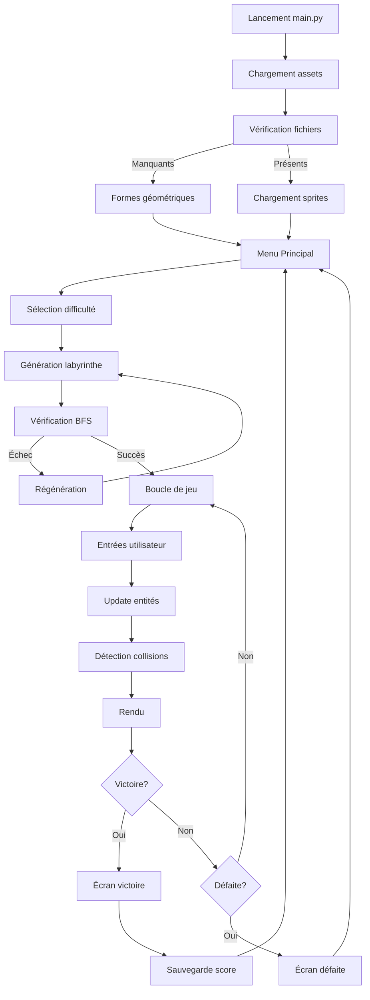

# Plan Final de Développement du Jeu de Labyrinthe Pygame

## Résumé du Projet
Jeu de labyrinthe 2D complet avec Pygame, comportant :
- Génération procédurale de labyrinthe (Recursive Backtracking)
- Vérification de victoire garantie par BFS
- 4 modes de difficulté avec paramètres différents
- Système de brouillard de guerre (fog of war)
- IA ennemis avec comportements variables
- Interface complète (menu, HUD, écrans de fin)
- Sauvegarde des high scores en JSON
- Optimisations de rendu (culling, masque de brouillard pré-calculé)

## Architecture Validée
Voir `architecture.md` pour les diagrammes détaillés.

## Fichiers à Créer
1. **`config.py`** - Constantes et configuration
2. **`maze.py`** - Génération de labyrinthe et BFS
3. **`entities.py`** - Classes Player, Enemy, Item
4. **`renderer.py`** - Système de rendu avec culling et brouillard
5. **`ui.py`** - Interface utilisateur
6. **`game.py`** - Logique principale du jeu
7. **`main.py`** - Point d'entrée avec fallback des assets
8. **`highscore.json`** - Fichier de sauvegarde (créé à l'exécution)

## Détails d'Implémentation

### 1. Configuration (`config.py`)
```python
SCREEN_WIDTH = 800
SCREEN_HEIGHT = 600
TILE_SIZE = 48
FPS = 30

DIFFICULTY_SETTINGS = {
    'easy': {'size': 10, 'potions': 3, 'fog_radius': None, 'enemies': 1},
    'medium': {'size': 20, 'potions': 6, 'fog_radius': 5, 'enemies': 3},
    'hard': {'size': 30, 'potions': 10, 'fog_radius': 3, 'enemies': 5},
    'extreme': {'size': 40, 'potions': 15, 'fog_radius': 2, 'enemies': 8}
}

ASSET_MAPPING = {
    'player': 'tile_0096.png',
    'enemy_wizard': 'tile_0084.png',
    'enemy_ghost': 'tile_0108.png',
    'enemy_monster': 'tile_0109.png',
    'potion_red': 'tile_0113.png',
    'potion_green': 'tile_0114.png',
    'potion_blue': 'tile_0115.png',
    'potion_purple': 'tile_0116.png',
    'exit': 'tile_0045.png',
    'floor1': 'tile_0043.png',
    'floor2': 'tile_0048.png',
    'floor3': 'tile_0049.png',
    'wall': 'tile_0001.png',
    'heart': 'tile_0044.png',
    'trap': 'tile_0089.png'
}
```

### 2. Génération de Labyrinthe (`maze.py`)
- Implémentation de l'algorithme Recursive Backtracking
- Placement aléatoire des potions, pièges et ennemis
- Vérification BFS pour garantir l'accessibilité
- Régénération automatique si le labyrinthe n'est pas valide

### 3. Système de Rendu (`renderer.py`)
- Chargement et redimensionnement des sprites (16x16 → 48x48)
- Culling : ne dessine que les tiles visibles à l'écran
- Brouillard de guerre avec surface SRCALPHA pré-calculée
- Camera centrée sur le joueur

### 4. Mécaniques de Jeu (`entities.py`)
- **Joueur** : 3 vies, invincibilité temporaire, knockback
- **Ennemis** : 3 types avec comportements différents
- **Items** : Potions (objectifs), Pièges (obstacles), Porte de sortie
- **IA** : Déplacement aléatoire pour les modes normaux, poursuite pour Extrême

### 5. Interface Utilisateur (`ui.py`)
- Menu principal avec sélection de difficulté (1-4)
- HUD affichant vies, potions collectées, chronomètre
- Écrans de victoire/défaite avec temps final
- Système de high score affichant les meilleurs temps

### 6. High Score (`highscore.json`)
```json
{
  "easy": 0.0,
  "medium": 0.0,
  "hard": 0.0,
  "extreme": 0.0
}
```
- Sauvegarde automatique à la fin d'une partie gagnée
- Affichage dans le menu principal

### 7. Fallback des Assets
Si un fichier sprite est manquant :
- Utiliser des formes géométriques colorées (rectangles, cercles)
- Afficher un message d'avertissement dans la console
- Continuer le jeu sans interruption

## Séquence d'Exécution
1. Lancement de `main.py`
2. Chargement des assets avec vérification
3. Affichage du menu principal
4. Sélection du mode de difficulté
5. Génération du labyrinthe avec vérification BFS
6. Boucle de jeu principale (30 FPS)
7. Gestion des événements (flèches + ZQSD)
8. Mise à jour des entités et collisions
9. Rendu avec culling et brouillard
10. Vérification des conditions de victoire/défaite
11. Sauvegarde du score si record battu
12. Retour au menu

## Tests à Effectuer
1. Génération de labyrinthe valide (tous les modes)
2. Accessibilité garantie (BFS)
3. Collisions joueur-ennemi-potion
4. Fonctionnement du brouillard selon le mode
5. IA ennemis (poursuite en mode Extrême)
6. Sauvegarde/chargement des high scores
7. Interface utilisateur (navigation clavier/souris)
8. Performance avec culling (40x40 tiles)

## Diagramme de Flux d'Exécution


## Prochaines Étapes
Le plan est maintenant complet et prêt pour l'implémentation. Je vais demander à l'utilisateur s'il est satisfait du plan ou s'il souhaite des modifications avant de passer en mode Code pour l'implémentation.